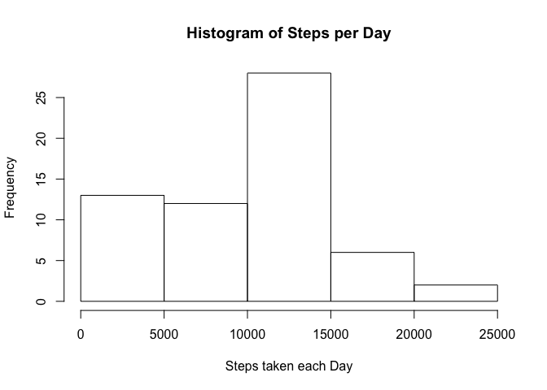
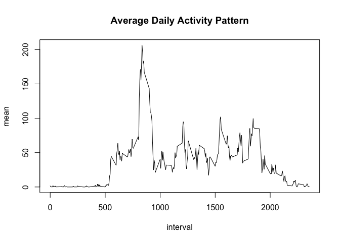
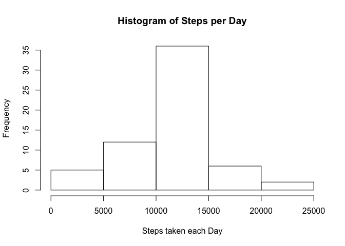
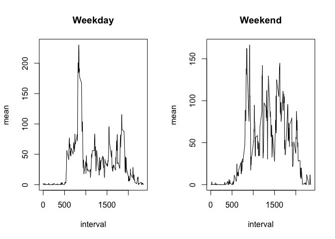

## Loading and preprocessing the data

```r
dirList <- dir()
if ("activity.csv" %in% dirList) {
        activity <- read.csv("activity.csv")
} else{
        stop("The file 'activity.csv' cannot be 
             found in the working directory.")
}
```
  
  
## What is mean and median total number of steps taken per day?  

The analyzed dataset set contains missing values and there are ignored in the calculations in this paragraph.


```r
library(dplyr)
activity_StepsPerDay <- activity %>% group_by(date) %>% 
                summarize(sum = sum(steps, na.rm = T))
hist(activity_StepsPerDay$sum, main = "Histogram of Steps per Day", xlab = "Steps taken each Day")
```

<!-- -->

```r
mean_StepsPerDay <- round(mean(activity_StepsPerDay$sum, na.rm = T), digits = 0)
median_StepsPerDay <- median(activity_StepsPerDay$sum, na.rm = T)
```

The mean and median of the total number of steps taken per day are:  
- median: 9354  
- median: 10395  


## What is the average daily activity pattern?

```r
library(stringr)
activity_StepsPerInterval <- activity %>% group_by(interval) %>% 
                summarize(mean = mean(steps, na.rm = T))
plot(activity_StepsPerInterval, type = "l", main = "Average Daily Activity Pattern")
```

<!-- -->

```r
intervalMaxSteps <- activity_StepsPerInterval %>% filter(mean == max(mean)) %>% select(interval)
interval_Start <- paste(substr(str_pad(intervalMaxSteps - 5, 4, pad = 0), 1, 2), ":", substr(str_pad(intervalMaxSteps - 5, 4, pad = 0), 3, 4) , sep = "")
interval_End <- paste(substr(str_pad(intervalMaxSteps, 4, pad = 0), 1, 2), ":", substr(str_pad(intervalMaxSteps, 4, pad = 0), 3, 4) , sep = "")
```

Interval 835, starting at 08:30am and ending at 08:35am, contains the maximum number of steps accross al days.


## Imputing missing values

```r
nbr_intervalMissingSteps <- activity %>% filter(is.na(steps)) %>% nrow()
```

The number of missing values in the original dataset is 2304.

In the following piece of code, the missing values will be replaced by the mean for that 5-minute time interval. Afterwards, the mean and median will be re-calculated and compared to the mean and median calculated on the dataset containing the missing values.


```r
intervalMissingSteps <- activity %>% filter(is.na(steps))
intervalMissingSteps_Updated <- merge(intervalMissingSteps, activity_StepsPerInterval, by = "interval", all = T)
intervalMissingSteps_Updated <- intervalMissingSteps_Updated %>% mutate(steps = round(mean, 0)) %>% select(steps, date, interval)
        
activity_New <- merge(activity, intervalMissingSteps_Updated, by = c("date", "interval"), all = T)
activity_New <- activity_New %>% mutate(steps.x = ifelse(is.na(steps.x), steps.y, steps.x)) %>% select(date, interval, steps = steps.x)
        
activity_New_StepsPerDay <- activity_New %>% group_by(date) %>% 
        summarize(sum = sum(steps, na.rm = T))
hist(activity_New_StepsPerDay$sum, main = "Histogram of Steps per Day", xlab = "Steps taken each Day")
```

<!-- -->

```r
mean_StepsPerDay_NoNA <- format(round(mean(activity_New_StepsPerDay$sum, na.rm = T), digits = 0), scientific = F)
median_StepsPerDay_NoNA <- format(median(activity_New_StepsPerDay$sum, na.rm = T), scientific = F)
```

The mean and median of the total number of steps taken per day calculated on the dataset with the mean per time interval imputed for the missing values are:  
- median: 10766  
- median: 10762

In conclusion, when missing values are replaced by the mean for that 5-minute time interval, the mean and median number of the steps taken per day are higher than the mean and median for that 5-minute time interval without replacement of missing values.


## Are there differences in activity patterns between weekdays and weekends?

```r
activity_New_WeekDay <- activity_New %>% 
        mutate(day = ifelse(weekdays(as.Date(date, format = "%Y-%m-%d")) %in% 
        c("Monday", "Tuesday", "Wednesday", "Thursday", "Friday"), "weekday", "weekend")) 
        
activity_MeanStepsPerWeekDay <- activity_New_WeekDay %>% filter(day == "weekday") %>%
                group_by(interval) %>% 
                summarize(mean = mean(steps, na.rm = T))
activity_MeanStepsPerWeekendDay <- activity_New_WeekDay %>% filter(day == "weekend") %>%
                group_by(interval) %>% 
                summarize(mean = mean(steps, na.rm = T))
        
par(mfrow = c(1,2))
plot(activity_MeanStepsPerWeekDay, type = "l", main = "Weekday")
plot(activity_MeanStepsPerWeekendDay, type = "l", main = "Weekend")
```

<!-- -->

As shown in the graphs above, on weekdays more steps were done around 7am than at the same time in the weekend, and on weekends more steps were done during the day than on weekdays. 
